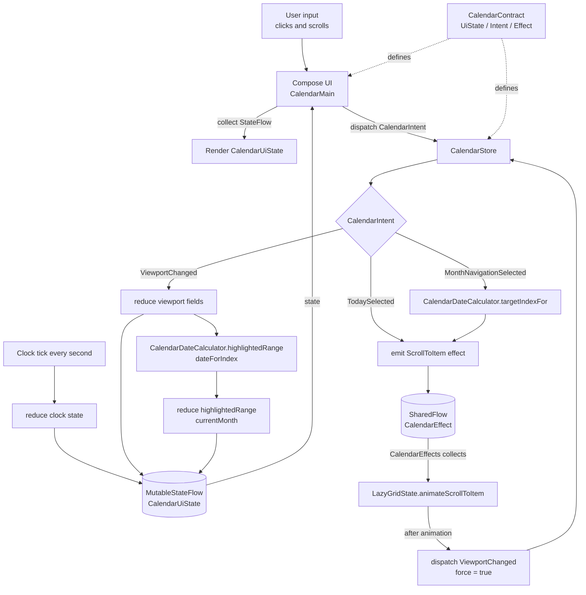

# A Windows 10 Calendar-Styled App


## Build Artifacts

GitHub Actions builds and uploads these artifacts for each run:

- Android release APK: `app-release`
- macOS arm64 Kotlin/Native artifacts: `calendar-macos-arm64-native`

The macOS artifact is built on GitHub Actions' `macos-14` arm64 runner without the JVM:

```bash
./gradlew \
  :shared:linkDebugSharedMacosArm64 \
  :ui:linkDebugFrameworkMacosArm64
```

Outputs:

- `shared/build/bin/macosArm64/debugShared/libshared.dylib`
- `shared/build/bin/macosArm64/debugShared/libshared_api.h`
- `ui/build/bin/macosArm64/debugFramework/ui.framework`

The `ui` framework depends on and exports the `shared` module, so native macOS code can link the UI framework while still accessing shared calendar logic.

## Run on macOS

The Kotlin/Native macOS output is not a standalone app yet. It produces a native framework and shared library that must be embedded in a macOS app target:

- `ui.framework`: Kotlin/Native UI framework that exports `shared`
- `libshared.dylib`: native shared library from the `shared` module

Build the native artifacts first:

```bash
./gradlew \
  :shared:linkDebugSharedMacosArm64 \
  :ui:linkDebugFrameworkMacosArm64
```

Then create or use a macOS SwiftUI/AppKit app target and link:

- `ui/build/bin/macosArm64/debugFramework/ui.framework`
- `shared/build/bin/macosArm64/debugShared/libshared.dylib`

The macOS app target should embed these artifacts in its app bundle and call the exported API from `ui.framework`. This repository does not currently include that macOS `.app` wrapper, so there is no JVM-free macOS app to launch directly yet.

For local development only, the existing Compose Desktop target can still be run with:

```bash
./gradlew :desktop:run
```

That desktop target uses JVM and is separate from the Kotlin/Native macOS framework artifacts above.

## MVI Architecture Flow


