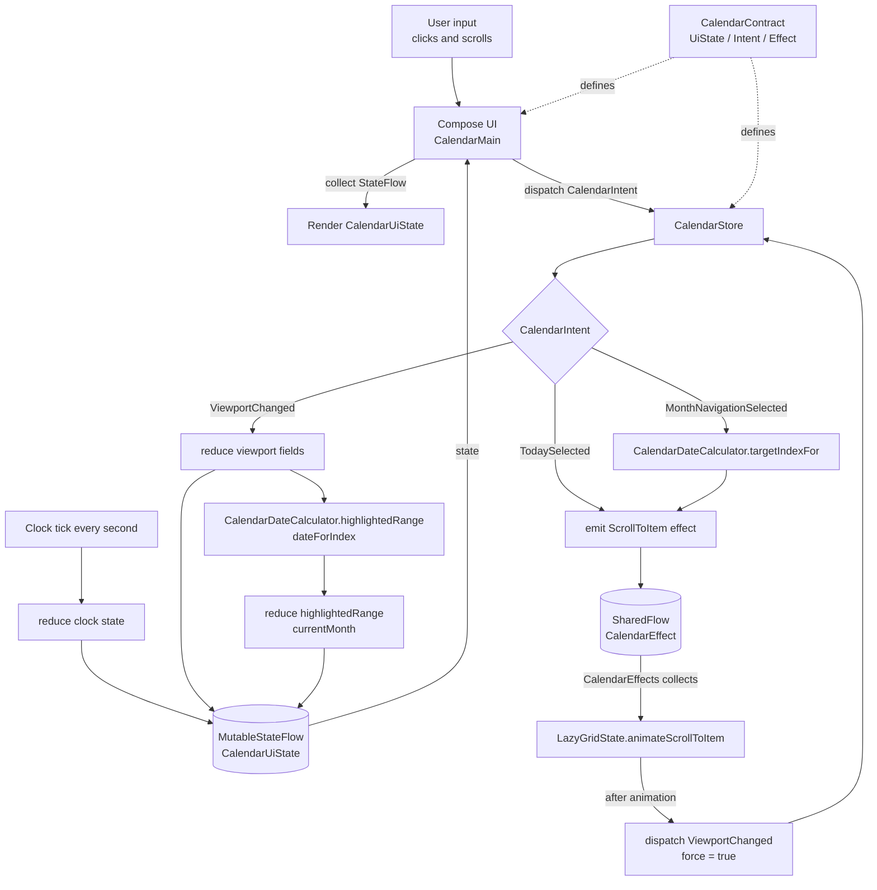

# A Windows 10 Calendar-Styled App


## Build Artifacts

GitHub Actions builds and uploads these artifacts for each run:

- Android release APK: `app-release`
- macOS arm64 DMG for Apple Silicon Macs: `calendar-macos-arm64`

The macOS artifact is built on GitHub Actions' `macos-14` arm64 runner with:

```bash
./gradlew :desktop:packageDmg
```

Local desktop packaging uses the current machine architecture. On an Apple Silicon Mac, the same command produces a macOS arm64 DMG under `desktop/build/compose/binaries/main/dmg/`.

## MVI Architecture Flow


