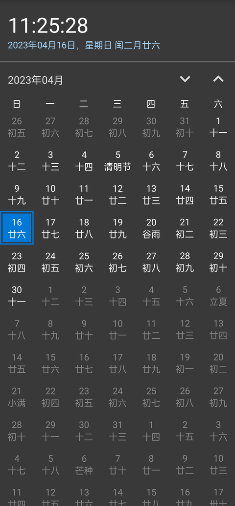
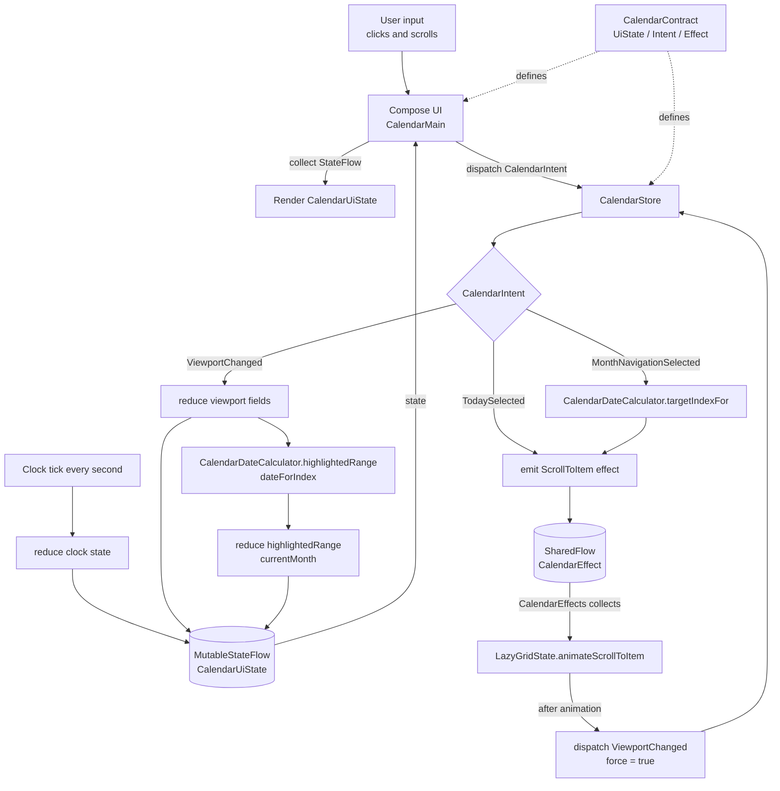

# A Winodws 10 Calendar-Styled App

## MVI Architecture Flow

```mermaid
flowchart TD
    User[User input<br/>clicks and scrolls] --> View[Compose UI<br/>CalendarMain]
    View -->|collect StateFlow| Render[Render CalendarUiState]
    View -->|dispatch CalendarIntent| Store[CalendarStore]

    Contract[CalendarContract<br/>UiState / Intent / Effect] -. defines .-> View
    Contract -. defines .-> Store

    Store --> Intent{CalendarIntent}
    Intent -->|TodaySelected| ScrollEffect[emit ScrollToItem effect]
    Intent -->|MonthNavigationSelected| TargetIndex[CalendarDateCalculator.targetIndexFor]
    TargetIndex --> ScrollEffect
    Intent -->|ViewportChanged| ViewportReduce[reduce viewport fields]
    ViewportReduce --> VisibleRange[CalendarDateCalculator.highlightedRange<br/>dateForIndex]
    VisibleRange --> MonthReduce[reduce highlightedRange<br/>currentMonth]

    Clock[Clock tick every second] --> ClockReduce[reduce clock state]

    ClockReduce --> State[(MutableStateFlow<br/>CalendarUiState)]
    ViewportReduce --> State
    MonthReduce --> State
    State -->|state| View

    ScrollEffect --> Effects[(SharedFlow<br/>CalendarEffect)]
    Effects -->|CalendarEffects collects| Animate[LazyGridState.animateScrollToItem]
    Animate -->|after animation| ForcedViewport[dispatch ViewportChanged<br/>force = true]
    ForcedViewport --> Store
```
